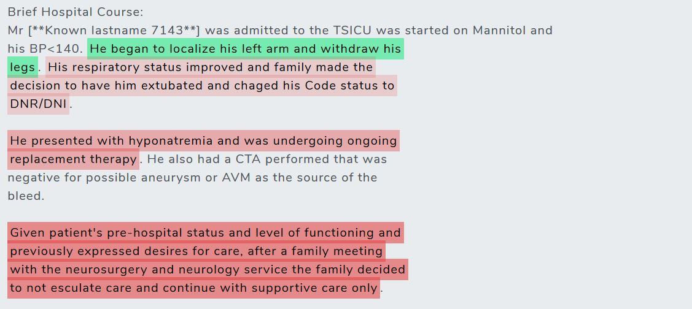
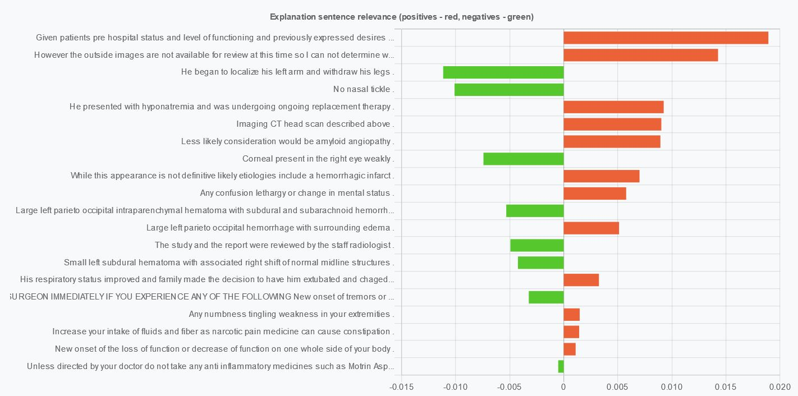
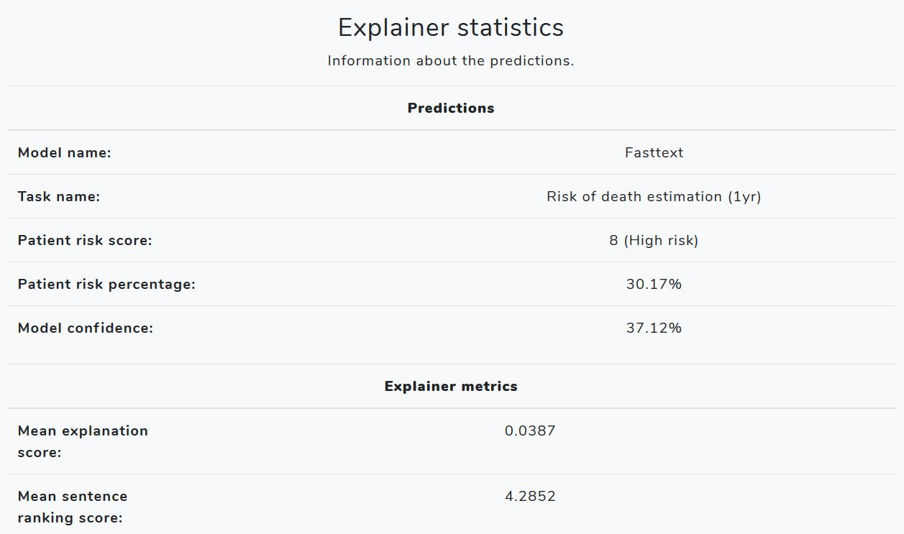

# Patient Risk Explainer

#### A model-agnostic tool for explaining text-based risk classification predictions for patients in Intensive Care Units. 

##### CS5917: MSc Project in Artificial Intelligence (Industrial Placement with the partnership of [RedStar](https://www.linkedin.com/company/red-star-ai/about/))

A LIME-based explainer for interpreting risk factors regarding possible clinical outcomes from patient discharge letters. Includes modules for sentence ranking and highlighting, alongside other statistics regarding the accumulated results. Allows the user to upload a discharge letter (as a .txt file) and generate an explanation for it, as well as select the model configuration.

##### Purpose of the system

This app is meant to serve as an assistant tool for clinicians who monitor and perform patient EHR readings. It aims to minimize the time spent on an EHR, in order to reach a conclusion regarding the patient's condition and the required intervention. As a result, this can also reduce the error rate of clinicians, who otherwise perform these readings manually on large volumes of text. Thus, It can be beneficial to health surveillance systems for filtering and diagnosing high-risk patients within a large number of records.<br>

##### Functionality
The app currently supports two functioning models, implemented in <b>Keras(TF2)</b>:

- Fasttext <b>(AUC: 0.85)</b>
- 1D-Conv-LSTM <b>(AUC: 0.87)</b>

The tasks supported by the explainer are:

- <b>Risk of death within 1 year</b>
- <b>Risk of hospital readmission within 30 days</b>

You can also customize the model decision boundary for positive and negative classes, which affects the risk score ([1-10]).

##### Data
The text classification models were trained on the specified tasks using the [<b>MIMIC III</b>](https://mimic.physionet.org/gettingstarted/access/) database (use the specified link to find out how to get access).

##### Frameworks
The model/explainer frameworks (in the notebooks folder) were developed using [<b>Google Colab</b>](colab.research.google.com). The web app is developed using [<b>Flask</b>](https://flask.palletsprojects.com/en/1.1.x/) (blueprint modules) and <b>Python 3.7</b>. The deployment branch includes an [<b>AWS Elastic Beanstalk</b>](https://aws.amazon.com/elasticbeanstalk/) configuration for building the production system. The app also includes a modified version of the original [<b>LIME</b>](https://github.com/marcotcr/lime) package, which includes sentence perturbations, available [<b>here</b>](https://github.com/JadeBlue96/lime). To run the explanations an NVIDIA GPU (TF2) is required (tested with GTX 960M). The front-end visualization libraries include:
- [<b>Mark.js</b>](https://markjs.io/) (Sentence highlighting with weighting for each class)
- [<b>Chart.js</b>](https://www.chartjs.org/) (Sentence importance plot)
- [<b>Bootstrap 4 template</b>](https://getbootstrap.com/)

##### Examples
<b>Sentence highlighting (green - negative, red - positive LIME explanation scores)</b>


<b>Sentence importance plot for visualizing the explanation scores.</b>


<b>Explainer statistics (related to the model predictions and explanation scores)

##### Instructions on running the system
<b>1.</b> Clone the project from this repository to your local directory using:
```bash
git clone https://github.com/JadeBlue96/Patient-Risk-Explainer.git
```
<b>2.</b> Create a new conda environment to install the packages in:
```bash
conda create -n prme python=3.7
conda activate prme
```
<b>3.</b> Install the required libraries using pip:
```bash
pip install –r requirements.txt
```
<b>4.</b> Pull the model files from S3 using:
```bash
aws s3 sync s3://prme-main/ . --no-sign-request
```
<b>5.</b> Set the Flask app environment variables in your environment and run it locally:
```bash
set FLASK_APP=app.py
set FLASK_ENV=development
flask run
```
<b>6.</b> Check that every package is installed correctly and that the models are downloaded successfully by running the unit tests:
```bash
python -m pytest --cov-report term-missing --cov=src tests/
```
